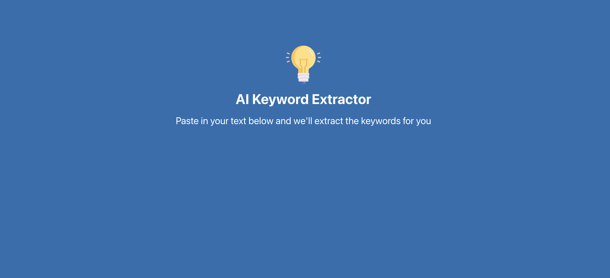

# Build a Keyword Extractor: React + OpenAI API + Chakra UI
Tutorial URL: https://www.youtube.com/watch?v=jJNPPP2YEdM
Tutorial description: Build and deploy a keyword extractor powered by OpenAI, using React, Vite and Chakra UI.

___________

### Software versions

### Problems in the project:
1.
2.

### How to use

### Photos of project:

### Apps used:
Sublime Text: [https://www.sublimetext.com/](https://www.sublimetext.com/) 

Tabby: [https://tabby.sh/](https://tabby.sh/) 

GitHub CLI: [https://cli.github.com/](https://cli.github.com/) 
Google Chrome: [https://www.google.com/chrome/dr/download/](https://www.google.com/chrome/dr/download/)

### Coding styles I used:

### What I learned
1. I learned about ChakraUI for react and the different attributes used in it's components such as attributes as the 'bg' attribute with values such as 'blue.600' for setting the color blue and the least number is the lightest of the color while the greater number is the darker the color.